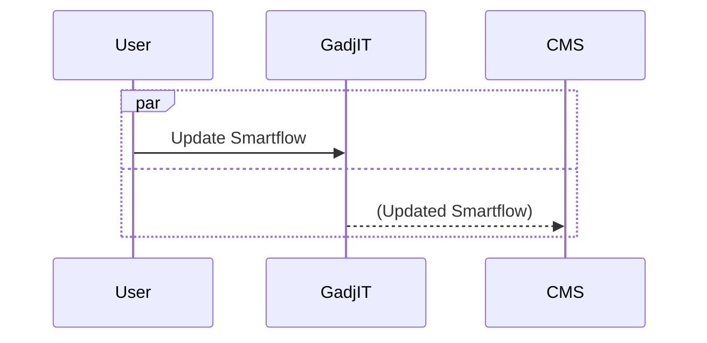
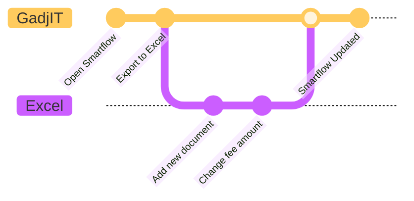
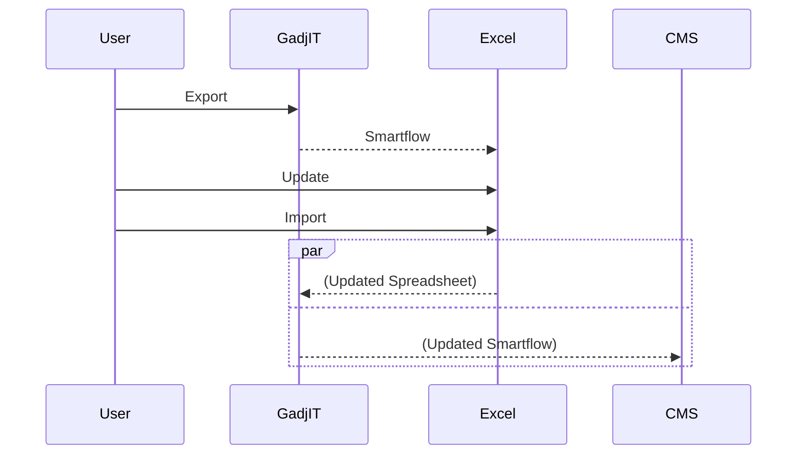

# Development Options
As you would expect with a modern online facility, GadjIT offers an intuative easy to navigate interface to quickly create and maintain Smartflows. All changes made within GadjIT are instantly available within your Case Management System. GadjIT offers two methods of development, the **GadjIT** toolkit or **Excel**.

## GadjIT Toolkit
There is no code required within GadjIT and almost all elements are selected via dropdowns and filtered lists so it is not only an efficient way of working but free from coding errors. The screens are set in an order to assist users with navigation.  

### Overview: Updating Smartflows via GadjIT
The following chart details the process for updating a Smartflow via GadjIT. 

> [!NOTE] 
> The **Case Management System**** is updated automatically and instantly as soon as any change within GadjIT is made.

`
  ----> indicate activities that occur automatically
`

**Chart 1** - Updating Smartflow in GadjIT

## Develop within Excel
Even though GadjIT offers a rapid development toolkit, it also offers the ability to develop within Excel. This ability is a real strength of GadjIT as Excel is an application most users are already familiar with. 

**Self Documenting**
By exporting a Smartflow to Excel, you provide full documentation in an instance. Several tabs reflect the various screens within GadjIT, each listing all relevant details in an easy to understand format.

**Import Changes**
In addition to exporting a Smartflow to Excel, you can also import any changes back. Simply alter details in the Excel spreadsheet using the lookup tab for access to case precedents before importing back into GadjIT. Once imported, the changes are instantly reflected both in GadJIT as well as the Case Management System.

**Chart 2** - Process: Updating a document and fee via Excel

### Overview: Updating Smartflows via Excel
The following chart details the process for updating a Smartflow via Excel. 

> [!NOTE] 
> GadjIT and the CMS are both updated automatically as soon as the spreadsheet is imported back into GadjIT

`
  ----> indicate activities that occur automatically
`

**Chart 3** - Updating Smartflow via Excel

