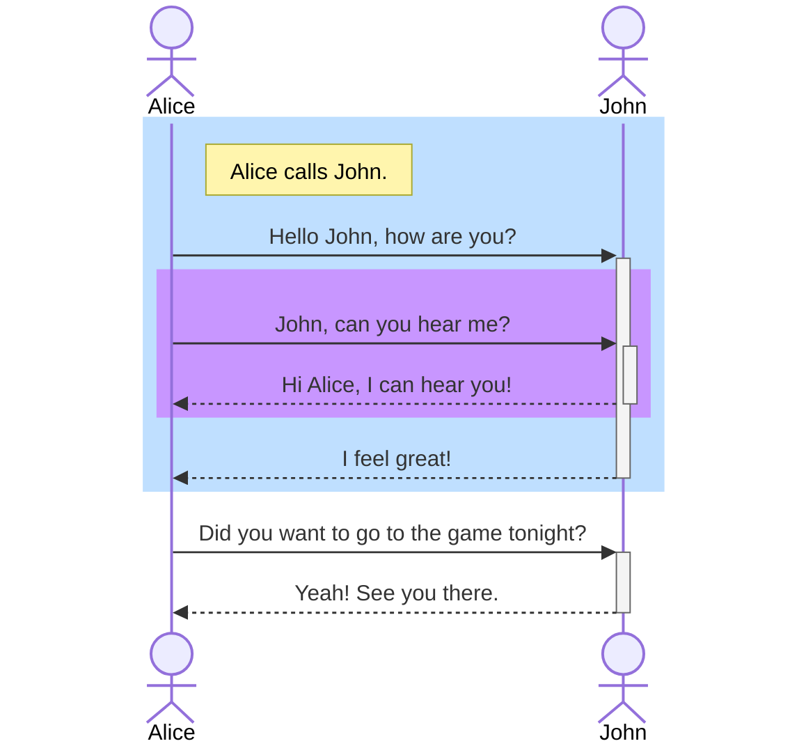

# Add your introductions here

## level 2

some text but with a **word** highlighted

h1 | h2 | h3
---|----|---
v1 | v2 | v3
v1 | v2 | v3
v1 | v2 | v3

<h1>In this section</h1>

 <ol> 
  <li>Agenda folders</li>
  <li>Statuses</li>
  <li>Documents</li>
    <ol>
      <li>Add new</li>
      <li>Deleting</li>
      <li>Attachments</li>
      <li>Custom items</>
    </ol>
  <li>Fees</li>
  <li>Data</li>
  <li>Messages</li>
  <li>Background</li>
 </ol>

# In this section:
 
 - Agenda folders
 - Statuses
 - Documents
   - Adding
   - Deleting
   - Attachments
   - Custom items
 - Fees
 - Data
 - Messages
 - Background

# In this section:

 1. Agenda folders
 2. Statuses
 3. Documents
    - Adding
    - Deleting
    - Attachments
    - Custom items
 4. Fees
 5. Data
 6. Messages
 7. Background

    
# Testing a link     
> Access Smartflow here: [Smartflow](https://gadjit.orchardrock.co.uk/smartflow)

# Testing an Image

> this is a block quote

---

## <i class="fas fa-puzzle-piece" aria-hidden="true"></i> Puzzle Icon
{: #puzzle}

> [!NOTE] 
> Information the user should notice even if skimming. 

> [!TIP] 
> Optional information to help a user be more successful. 

> [!IMPORTANT] 
> Essential information required for user success. 

> [!CAUTION] 
> Negative potential consequences of an action. 

> [!WARNING] 
> Dangerous certain consequences of an action.

## Another diagram

  graph LR
      A[Client] --- B[Load Balancer]
      B-->C[Server01]
      B-->D(Server02)

