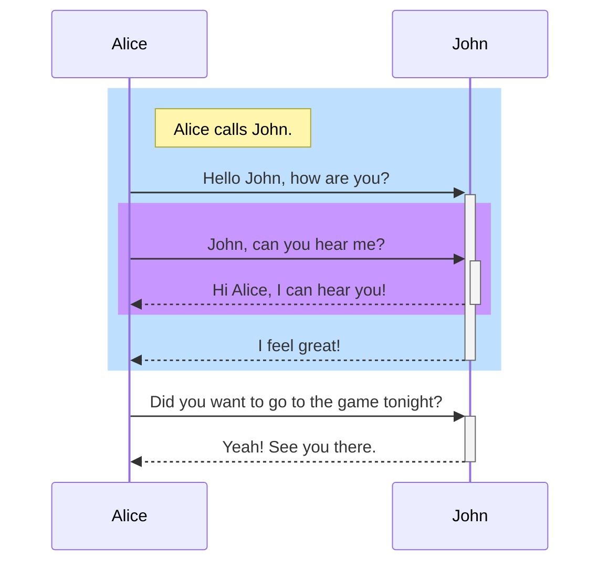

# Add your introductions here

## level 2

some text but with a **word** highlighted

h1 | h2 | h3
---|----|---
v1 | v2 | v3
v1 | v2 | v3
v1 | v2 | v3

  
> this is a block quote

---

## <i class="fas fa-puzzle-piece" aria-hidden="true"></i> Puzzle Icon
{: #puzzle}

> [!NOTE]
> <note content> this is some content

> [!WARNING]
> <warning content> some warning message

> [!INFO]
> <info content> some info
