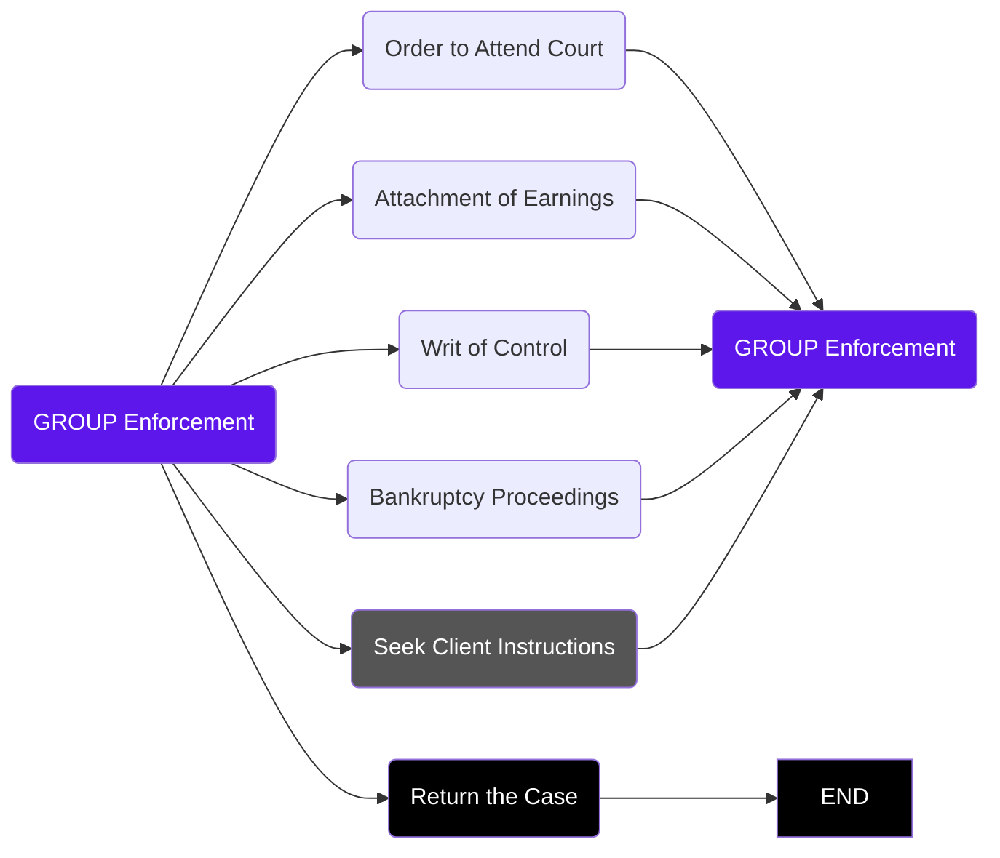

# What is a Group Screen?
A **Group Screen** is simply a standard Smartflow Screen but instead of listing **actions** relevant to the **current task**, it instead lists the Smartflows available within the workflow or a particular milestone. For example, the group screen below lists several Smartflows that together make up the Enforcement milestone of a typical Debt Collection workflow.

## When to Use a Group Screen
**Group Screens** are primarily used to help users navigate between Smartflows. They are not compulsory, but do come in handy especially when it is difficult to predict which task is the most appropriate. 

For example, in a Debt Collection workflow you may have several Smartflows, each dedicated to a particular enforcement type such as *Order to Attend Court* or *Attachment of Earnings*. As each enforcement type is exhausted, it is often at the fee earners discretion which other enforcement type to enter, or take another approach altogether such as seeking advice from the client or to return the case. A **Group Screen** is ideal for presenting the user with the appropriate options.

> [!NOTE]
> **Actions** can be any one of the following; Letter, Document, Form or other Smartflow.

> [!NOTE]  
> **Current task** refers to the stage within a case being dealt with by the Smartflow. For example, in a Debt Collection workflow you may have a Smartflow dedicated to dealing with a particular enforcement such as Order to Attend Court, and this Smartflow will contain only relevant **actions** to process this particular enforcement. 

  
**Figure 1** - Typical Smartflow Group Screen

## Group Screen Status
The **data values** displayed in a Group Screen reflect the current status for each Smartflow listed in the Group Screen. These values are updated automatically by Smartflow as **actions** are processed.

> [!NOTE]  
> **Data values** refer to custom data items related to the workflow. For example, in a Debt Collection workflow you may store deatils such as the `Debt Amount` or `Hearing Date`. In addition to such values, the Smartflow system also tracks the `Status` for each individual Smartflow, these `Status` fields can also be available on other Smartflows such as **Group Screens**.

> [!TIP]  
> Just as with all Smartflow screens, it is possible to have multiple tabs displaying **data values**. It is advised on a Group Screen to display the `Status` tab first as this is the most relevant.

  
**Figure 2** - Status values in a Group Screen  

# Group Screen Example
## Debt Collection Enforcement
As described already, the Enforcement milestone within a Debt Collection workflow is made up of several enforcement types. A fee earner will select the most appropriate type and if exhausted without a successful outcome, may select another type to process or perhaps return the case or seek further instructions from the client. Therefore, the Group Screen will provide access to all enforcement types (Smartflow for each) as well as Smartflows for seeking client instructions and returning the file. In turn, each Smartflow will give access back to the Group Screen so the fee earner can select the next appropriate action.

*The diagram below illustrates a basic flow for the Enforcement milestone described above.*

**Chart 1** - Enforcement Group Screen

